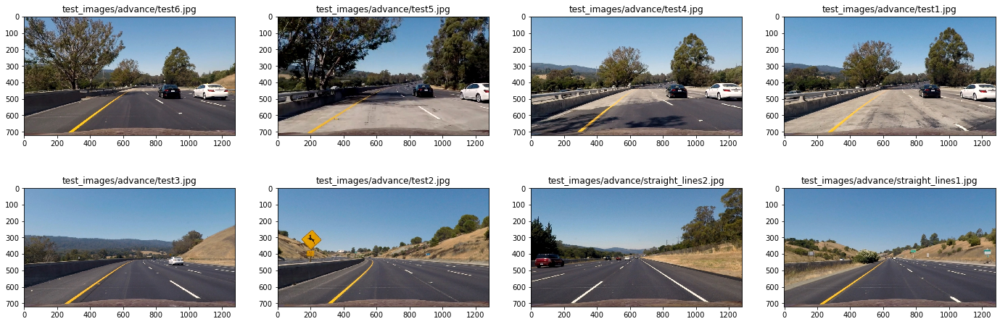

# Finding Lane Lines on the Road

## Overview

In this project, we wanted to define the lane that the driving car should stay in. This involved defining a pipeline that could take an image of the road from a car-mounted camera and ultimately annotate the image for the car to remain within the lane. We also added additional information for the car to use such as calculating the radius of curvature of the lane.

# Pipeline Parts

## Pipeline Results: Video

## Camera Calibration (Distortion Correction)

Relevant code to define the camera matrix can be found in thi notebook's section [finding_lanes-advanced.ipynb#Camera-Calibration](finding_lanes-advanced.ipynb#Camera-Calibration) and then applied in the pipeline with the function `undistort_image()` (found in this section [finding_lanes-advanced.ipynb#Undistort](finding_lanes-advanced.ipynb#Undistort)).

Below we use the camera matrix and distortion coefficients to transform the image into what we would expect the image to look like:

We did this by first finding the camera matrix by assuming first that the chessboard image is fixed in the third dimension (z=0) so that the object points (corners of the squares within the grid) are the same for each chessboard calibration image. We then used the method from OpenCV `findChessboardCorners()` to find the corners of the board to create image points. Using OpenCV's `calibrateCamera()` method to find the camera calibration and distortion coefficients, we were then able to undistort images from the same camera via another OpenCV method `undistort()`.

This process was then part of the pipeline to undistort the images. A few sample images are shown below:

## Color Transforms

We used a combination of applications of the OpenCV `Sobel()` method to get different attributes of the image gradient (each with its own tuned threshold and parameters.) This included calculating the absolute value of the x & y components of the gradient (`abs_sobel_thresh()`), the gradient magnitude (`mag_thresh()`), and the gradient direction (`dir_threshold()`).

These methods were tuned and combined together in the `full_binary_image()` method to produce images like the ones below:

## Perspective Transform

Relevant code that performed a perspective transformation (to a "bird's-eye view") can be see in this notebook's section [finding_lanes-advanced.ipynb#Perspective-Transform](finding_lanes-advanced.ipynb#Perspective-Transform). This was then incorporated into the overall pipeline. We defined a trapezoid that approximately aligns with lane lines from the road. We could then take these points to create a warp matrix which was then used to warp the image. Below are images before and after the transformation:

## Lane Line Pixels Identified with a Curved Functional Form

## Radius of Curvature Calculations

# Discussion

## Challenges Faced

## Improvements
(TODO:)
- Where it fails
- Where it could fail
- Improvements to pipeline