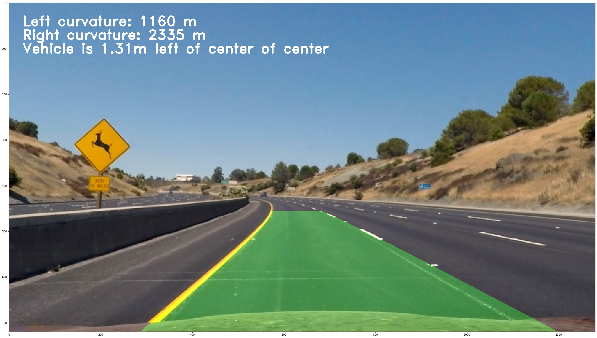
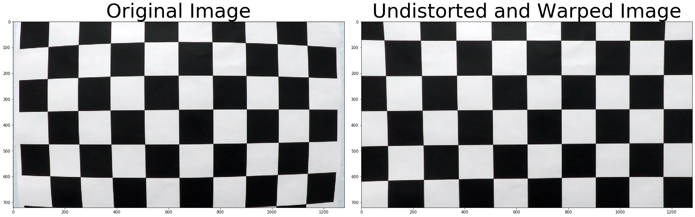
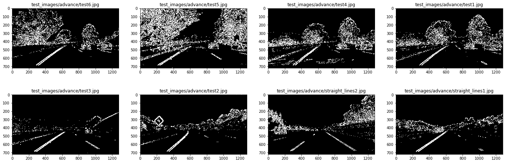
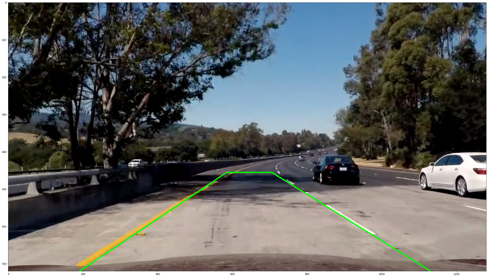
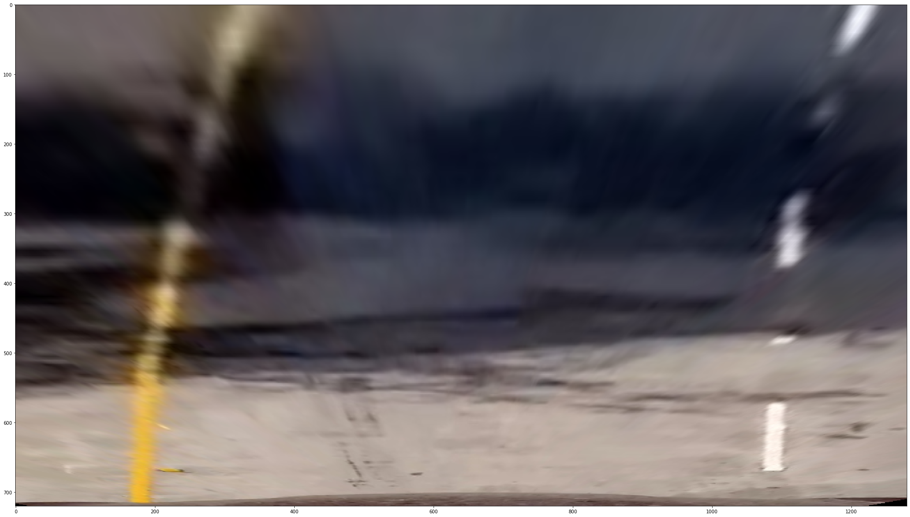
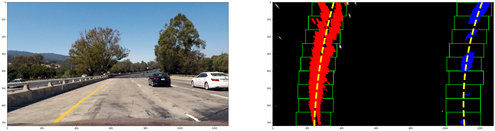
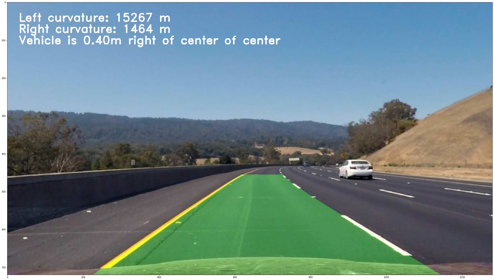

# Finding Lane Lines on the Road

## Overview

In this project, we wanted to define the lane that the driving car should stay in. This involved defining a pipeline that could take an image of the road from a car-mounted camera and ultimately annotate the image for the car to remain within the lane. We also added additional information for the car to use such as calculating the radius of curvature of the lane.

# Pipeline Parts

## Pipeline Results: Video

## Camera Calibration (Distortion Correction)

## Color Transforms

## Perspective Transform

## Lane Line Pixels Identified with a Curved Functional Form

## Radius of Curvature Calculations

# Discussion

## Challenges Faced

## Improvements
(TODO:)
- Where it fails
- Where it could fail
- Improvements to pipeline